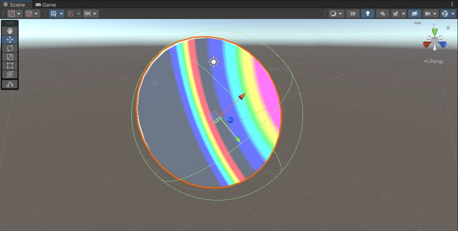

# iridence_modeling
В данной курсовой работе я сделал обзор функционала Unity в качестве среды моделирования и разобрал основы моделирования графических эффектов. Результатом этого разбора стал шейдер для материала, имитирующий иридисценцию. 

